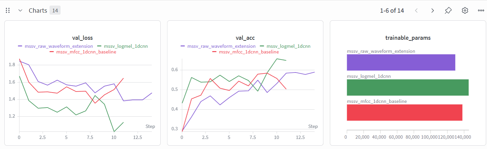
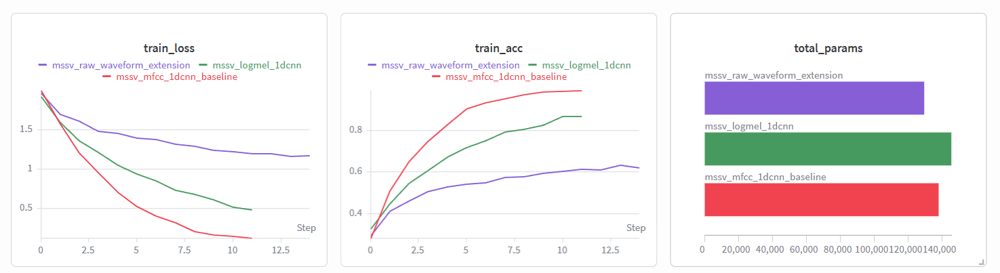
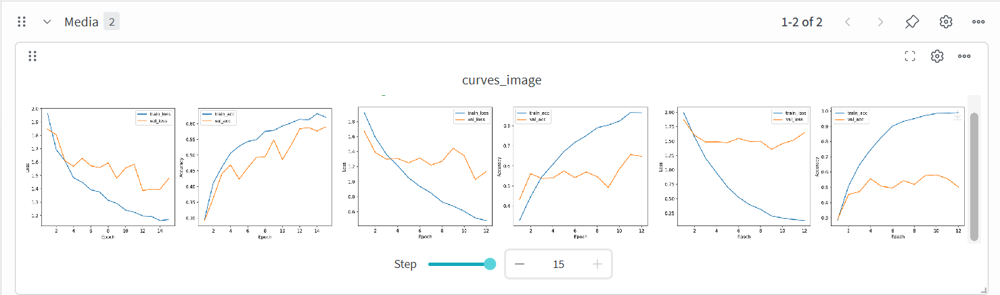
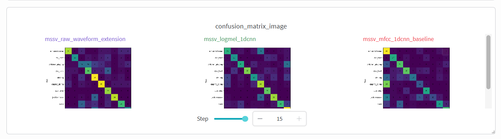

# CSC4005 Lab 3 Report – UrbanSound8K with 1D-CNN

## 1. Thông tin sinh viên

- Họ tên: Triệu Quốc Anh
- Mã sinh viên: 1671040002
- Lớp: KHMT 16-01
- Link GitHub repo: https://github.com/FIT-DNU-CS-16-01/csc4005-lab3-1dcnn-TrieuQuocAnh
- Link W&B run/project: https://wandb.ai/noioivedi-dainam-vietnam/csc4005-lab3-urbansound-1dcnn?nw=nwusernoioivedi

---

## 2. Mục tiêu thí nghiệm

Mô tả ngắn gọn mục tiêu của lab:

- phân loại âm thanh môi trường trên UrbanSound8K,
- sử dụng MFCC/log-mel làm chuỗi đặc trưng theo thời gian,
- xây dựng và huấn luyện 1D-CNN,
- theo dõi thí nghiệm bằng W&B,
- phân tích lỗi bằng confusion matrix.

---

## 3. Dữ liệu và tiền xử lý

### 3.1. Dataset

- Dataset: UrbanSound8K
- Số lớp: 10
- Các lớp: air_conditioner, car_horn, children_playing, dog_bark, drilling, engine_idling, gun_shot, jackhammer, siren, street_music
- Fold dùng để train: 1, 2, 3, 4, 5, 6, 7, 8
- Fold dùng để validation: 9
- Fold dùng để test: 10

### 3.2. Tiền xử lý audio

Điền cấu hình đã dùng:

| Thành phần | Giá trị |
|---|---|
| Sample rate | 16000 |
| Duration | 4.0 |
| Feature type | MFCC |
| n_mfcc / n_mels | 40 |
| n_fft | 1024 |
| hop_length | 512 |
| Augmentation | Time-frequency masking |

Giải thích ngắn: vì sao cần đưa audio về cùng sample rate và cùng độ dài?

Việc chuẩn hóa sample rate đảm bảo tất cả audio có cùng tần số lấy mẫu, tránh sai lệch trong đặc trưng. Độ dài cố định giúp batching hiệu quả và mô hình nhận input đồng nhất.

---

## 4. Mô hình 1D-CNN

Mô tả kiến trúc mô hình:

```text
Input feature sequence [batch, 40, T]
→ Conv1D block 1: Conv1d(40→64, k=5, p=2) → BatchNorm → ReLU → MaxPool1d(2)
→ Conv1D block 2: Conv1d(64→128, k=5, p=2) → BatchNorm → ReLU → MaxPool1d(2)
→ Conv1D block 3: Conv1d(128→128, k=5, p=2) → BatchNorm → ReLU → MaxPool1d(2)
→ Global Average Pooling (AdaptiveAvgPool1d(1))
→ Flatten
→ Dropout(0.35)
→ Dense classifier: Linear(128→10)
→ Softmax
```

Bảng cấu hình:

| Thành phần | Giá trị |
|---|---|
| model_name | mfcc_1dcnn |
| hidden_channels | [64, 128, 128] |
| dropout | 0.35 |
| optimizer | AdamW |
| learning rate | 0.001 |
| weight decay | 0.0001 |
| batch size | 32 |
| epochs | 12 |
| patience | 4 |

---

## 5. Kết quả thực nghiệm

### 5.1. Kết quả chính

| Metric | Giá trị |
|---|---:|
| Best validation accuracy | 57.88% |
| Test accuracy | 55.05% |
| Average epoch time | 6.63 s |
| Total parameters | 137,930 |
| Trainable parameters | 137,930 |

### 5.2. Learning curves

Chèn hình `curves.png`.

Nhận xét:

- Train loss/val loss có giảm đều không? Train loss giảm đều, val loss giảm đến epoch 9 rồi tăng nhẹ, cho thấy overfitting nhẹ.
- Có dấu hiệu overfitting không? Có, val acc đạt đỉnh ở epoch 10 rồi giảm.
- Early stopping có xảy ra không? Không, chạy hết 12 epochs.

### 5.3. Confusion matrix

Chèn hình `confusion_matrix.png`.

Nhận xét:

- Những lớp nào dễ phân loại? Các lớp có đặc trưng rõ ràng như gun_shot, siren.
- Những lớp nào dễ bị nhầm? Các lớp tương tự như children_playing và dog_bark, hoặc drilling và jackhammer.
- Có thể do đặc trưng âm thanh, độ dài clip, nhiễu nền, hay mất cân bằng dữ liệu? Có thể do nhiễu nền, độ dài clip ngắn, và mất cân bằng dữ liệu.

---

## 6. W&B tracking

Dán link W&B:

```text
https://wandb.ai/noioivedi-dainam-vietnam/csc4005-lab3-urbansound-1dcnn?nw=nwusernoioivedi
```

Ảnh chụp hoặc mô tả dashboard cần có:

- learning curves,
- final metrics,
- configuration,
- confusion matrix image.




---

## 7. Phân tích và thảo luận

Trả lời ngắn các câu hỏi:

1. Vì sao dùng 1D-CNN thay vì MLP cho chuỗi đặc trưng audio? 1D-CNN học được các pattern cục bộ và invariant trong chuỗi thời gian hiệu quả hơn MLP.
2. Kernel 1D trong bài này đang trượt theo chiều nào? Theo chiều thời gian của chuỗi đặc trưng MFCC/log-mel.
3. MFCC giúp mô hình học dễ hơn raw waveform ở điểm nào? MFCC cô đọng thông tin âm thanh, ít chiều hơn, tập trung vào đặc điểm quan trọng, giảm nhiễu.
4. Mô hình hiện tại còn hạn chế gì? Độ chính xác thấp (55%), overfitting nhẹ, kiến trúc đơn giản.
5. Có thể cải thiện kết quả bằng cách nào? Sử dụng kiến trúc sâu hơn, thêm regularization, data augmentation mạnh hơn, transfer learning từ pre-trained models.

---

## 8. Bài mở rộng nếu có

Nếu làm raw waveform hoặc log-mel, điền bảng sau:

| Pipeline | Feature/Input | Test accuracy | Nhận xét |
|---|---|---:|---|
| Baseline | MFCC + 1D-CNN | 55.05% | Baseline với MFCC đạt 55% accuracy. |
| Extension 1 | log-mel + 1D-CNN | 64.09% | Log-mel spectrogram cải thiện accuracy lên 64%, tốt hơn MFCC. |
| Extension 2 | raw waveform + 1D-CNN | 60.22% | Raw waveform đạt 60%, tốt hơn MFCC nhưng kém log-mel, thời gian train lâu hơn. |

---

## 9. Kết luận

Tóm tắt 3–5 ý chính học được từ lab.

1. 1D-CNN hiệu quả cho classification chuỗi đặc trưng audio như MFCC và log-mel.
2. Log-mel spectrogram thường cho kết quả tốt hơn MFCC cho classification âm thanh.
3. Data augmentation và regularization quan trọng để tránh overfitting.
4. W&B hữu ích cho tracking experiments và visualization.
5. Raw waveform yêu cầu mô hình phức tạp hơn và thời gian train lâu hơn.
